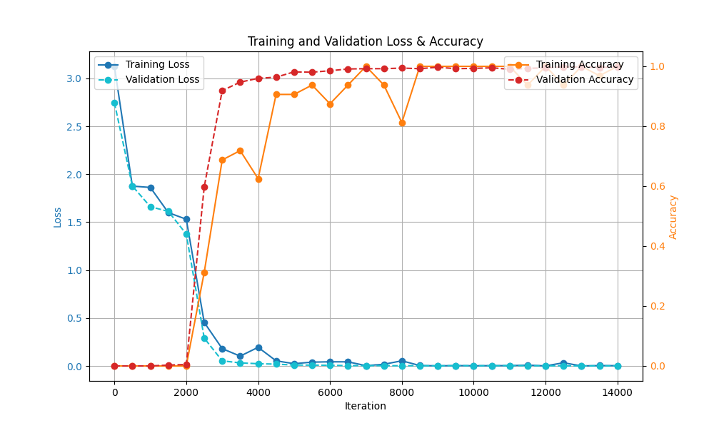
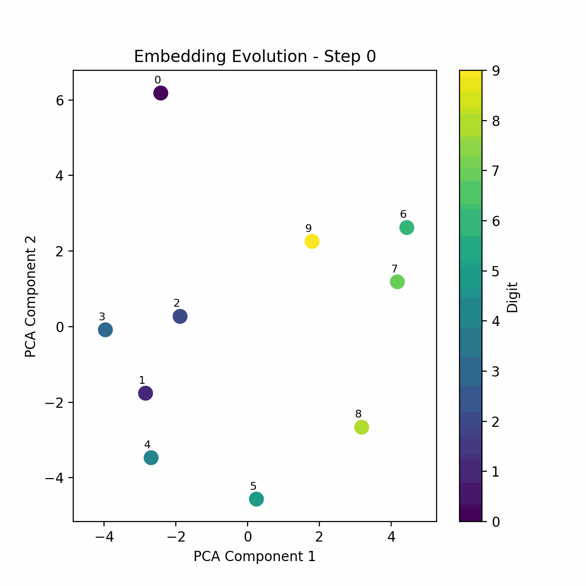

# adder-gpt

This repository contains code to train and run a GPT model to do addition on numbers of six digits or less. The training code can be found in `adder_gpt.ipynb`. The PyTorch state-dict for the trained model is saved in `adder_gpt_state_dict.pth`.


You can also run the Adder-GPT on your command line. First, install the necessary requirements with `pip install -r requirements.txt`. You can then run Adder-GPT like so:

```
saahithjanapati@saahiths-mbp adder-gpt % python3 run.py               
Input a positive integer a, 6 digits or less: 45612
Input a positive integer b, 6 digits or less: 986543
Generated answer: 1032155 ✅
Loss: 2.890809810196515e-06
```


## Training Curves



## Evolution of Digit Token Embeddings Throughout Training

The following GIF displays evolution of token embeddings correspoding to the digits 0-9. By this PCA visualization, it doesn't look like they change a ton during training.



## 